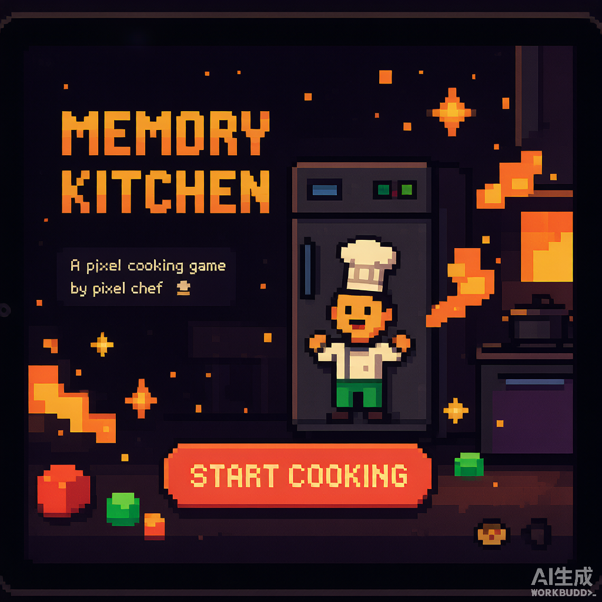
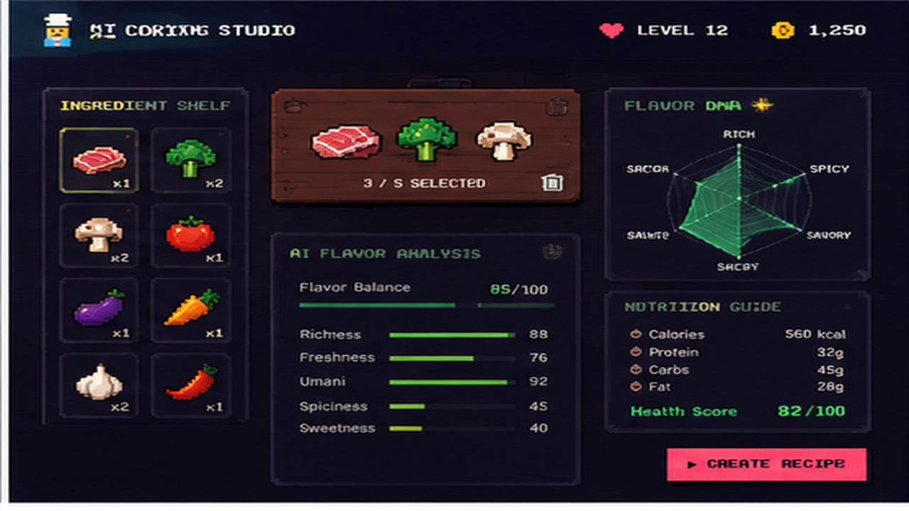
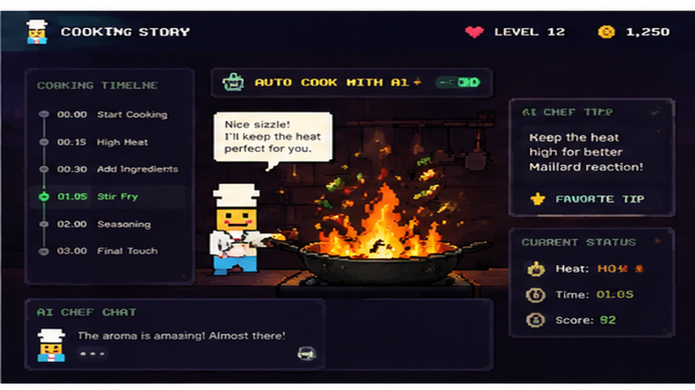
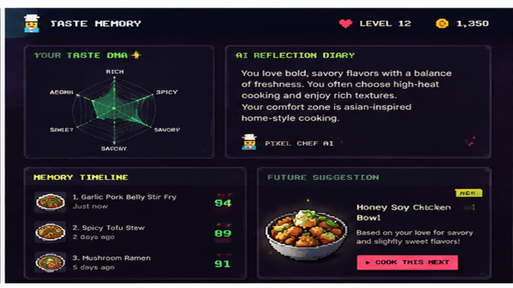

# 🍳 Pixel Chef AI

**A Memory Kitchen That Learns Your Taste.**

> Built for the **DEV Frontend Challenge** — fully client-side, zero backend, pure vibes.

---

## Overview

Pixel Chef AI is an interactive AI cooking companion that lives inside a pixel-art kitchen. You pick ingredients from the fridge, toss them into the pot, and watch a real-time cooking simulation unfold — complete with random fire events, AI chatter, and a personality engine that builds your unique Taste DNA. Every cook generates a diary entry, a timeline memory, and future recipe suggestions.

---

## ✨ Features

- 🤖 **AI Cooking Companion** — Your pixel sous-chef guides you through every step
- 🧊 **Interactive Pixel Kitchen** — Open the fridge, pick ingredients, toss into the pot
- 🔥 **Real-time Cooking Simulation** — Countdown timer, random fire/seasoning/flavor events, AI chat
- 🧬 **Taste Personality System** — AI analyzes your cooking style and builds your Taste DNA
- 📝 **AI Diary & Memory Timeline** — Typewriter journal entries, cooking memories, future suggestions
- 🎮 **Pixel Game Feel** — 8-bit interface with Framer Motion animations, blinking chef, steam, sparkles
- 📱 **Fully Responsive** — Polished at 375px through ultrawide, mobile-first

---

## 📸 Demo Screenshots

| Home | Studio | Cooking | Memory |
|------|--------|---------|--------|
|  |  |  |  |

> Screenshots coming soon — replace the placeholders in `docs/screenshots/` with your own captures.

---

## 🚀 Demo Flow

```
Home (Memory Kitchen)
  ↓ Start Cooking
AI Cooking Studio
  ↓ Pick ingredients → toss into pot
  ↓ Start Cooking
Cooking Story Simulation
  ↓ Timer + fire events + AI chat
  ↓ Finish Cooking
Result Preview (scores)
  ↓ Save To My Taste Memory
Taste Memory Diary
  ↓ AI Reflection → Taste DNA → Timeline → Future Suggestion
```

---

## 🏗️ Tech Stack

| Layer | Technology |
|-------|-----------|
| Framework | React 18 + TypeScript |
| Build | Vite 5 |
| Animation | Framer Motion 11 |
| Styling | Tailwind CSS v3 + Custom Theme |
| Fonts | Press Start 2P · VT323 · Inter |
| State | React useState / useMemo / useRef |
| Persistence | localStorage (tutorial flag only) |

---

## 📐 Architecture

```
src/
├── components/
│   ├── common/          # ErrorBoundary, PageTransition, PixelLoader
│   ├── cooking/         # AIAdvisor, IngredientShelf, TasteMemoryCard, Story
│   │   └── story/       # ResultPreview, CookingProgress
│   ├── kitchen/         # MemoryKitchen (homepage)
│   ├── memory/          # AIReflection, TasteDNA, MemoryTimeline, etc.
│   └── ui/              # PixelButton, PixelChef, PixelCard, Header
├── engine/              # Core logic (no side effects)
│   ├── memoryEngine.ts  # Ingredient combo analysis + nutrition advice
│   ├── cookingEngine.ts # Cooking state machine + scoring
│   └── personalityEngine.ts  # TasteDNA archetype classification
├── pages/               # Top-level route pages
├── styles/              # theme.css, global styles
├── types/               # TypeScript interfaces
└── App.tsx              # SPA router (useState-based)
```

---

## 💻 Local Development

```bash
# Install
npm install

# Dev server
npm run dev

# TypeScript check
npm run lint

# Production build
npm run build

# Preview build locally
npm run preview
```

---

## 🚢 Deployment

### Vercel (recommended)

[](https://vercel.com/new/clone?repository-url=https://github.com/vivayang911/pixel-chef-ai)

Or manually:

```bash
npx vercel
```

SPA routing is handled via `vercel.json` — all routes fall back to `index.html`.

### Any Static Host

```bash
npm run build
# Upload the dist/ folder to Netlify, Cloudflare Pages, GitHub Pages, etc.
```

---

## 🔮 Future Ideas

- 🎵 Web Audio sizzle & chiptune sound effects
- 🗃️ IndexedDB recipe history
- 🤖 OpenAI / Gemini integration for real AI suggestions
- 🏆 Cooking achievements & unlockable pixel cosmetics
- 🌐 Social sharing: generate pixel recipe cards
- 📲 PWA for offline cooking

---

## 📄 License

MIT — cook freely!
