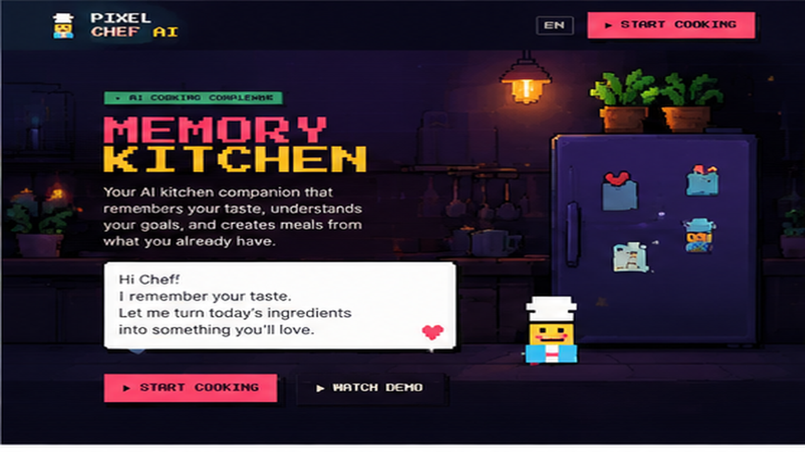
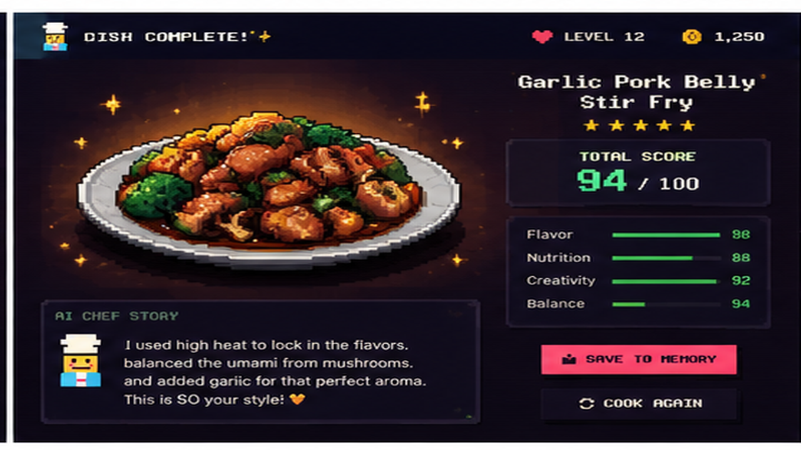

# 🍳 Pixel Chef AI

## A Memory Kitchen That Learns Your Taste

> An AI cooking companion that transforms your everyday ingredients into personalized comfort food — one memory at a time.

[](https://pixel-chef-ai.vercel.app)
[](LICENSE)



---

## What is Pixel Chef AI?

Pixel Chef AI is a personal AI cooking companion that **learns how you eat**.

Instead of giving generic recipes, Pixel analyzes your ingredients, taste preferences, nutrition goals, and cooking decisions to create meals that feel **personal**.

From opening your virtual fridge to saving your cooking memories, every interaction helps your AI chef understand you better.

**It is not just a recipe generator. It is a memory-driven kitchen companion.**

---

## Why AI?

Traditional recipe apps answer:

> *"What can I cook?"*

**Pixel Chef AI asks:**

> *"What would YOU enjoy cooking today?"*

The AI companion considers:

- 🧊 **Ingredients available** — what's in your virtual fridge right now
- 🧬 **Personal taste memory** — your flavor profile built across every meal
- 🎯 **Flavor preferences** — sweet, spicy, umami, and everything in between
- 💪 **Nutrition goals** — health-conscious, protein-rich, comfort-heavy
- 🔥 **Cooking behavior** — how you cook, what you choose, when you experiment

Every meal becomes a learning experience. Your AI chef grows with you.

---

## ✨ Features

- 🤖 **AI Cooking Companion** — A floating Pixel AI sous-chef that chats, reacts, and guides you in real time
- 🧊 **Interactive Pixel Kitchen** — Open the virtual fridge, browse ingredients, toss them into the pot
- 🔥 **Real-time Cooking Simulation** — Countdown timer with random fire events, seasoning moments, and live AI chatter
- 🧬 **Taste DNA System** — AI analyzes your cooking choices and builds a unique flavor personality profile
- 📝 **AI Diary & Memory Timeline** — Auto-generated journal entries, cooking reflections, and future recipe suggestions
- 📊 **Flavor DNA Radar** — 15-dimension flavor analysis visualized as an interactive SVG radar chart
- 🏠 **Smart Kitchen Vision** — Designed for future smart refrigerators, ingredient recognition, and personalized meal planning
- 🎮 **Pixel Game Feel** — 8-bit interface, Framer Motion animations, blinking chef, steam, and sparkles
- 🌐 **i18n Ready** — English, 中文, and 日本語 built in
- 📱 **Fully Responsive** — Polished from 375px mobile to ultrawide desktop

---

## 🚀 Demo Experience

```
        Home (Memory Kitchen)
              │  "Welcome back, Chef. I remember your taste."
              ▼
        ┌─────────────────────┐
        │  Open Smart Fridge   │  ← Browse your virtual ingredient shelf
        └─────────┬───────────┘
                  ▼
        ┌─────────────────────┐
        │  AI Ingredient       │  ← Flavor DNA preview updates in real time
        │  Recognition         │
        └─────────┬───────────┘
                  ▼
        ┌─────────────────────┐
        │  Choose Cooking      │  ← Stir-fry, steam, boil, deep-fry, roast, simmer
        │  Method              │
        └─────────┬───────────┘
                  ▼
        ┌─────────────────────┐
        │  Flavor DNA Analysis │  ← AI predicts flavor balance across 15 dimensions
        └─────────┬───────────┘
                  ▼
        ┌─────────────────────┐
        │  Personal Recipe     │  ← AI creates a recipe just for you
        │  Creation            │
        └─────────┬───────────┘
                  ▼
        ┌─────────────────────┐
        │  AI Cooking          │  ← Real-time simulation with fire events + AI chat
        │  Assistant           │
        └─────────┬───────────┘
                  ▼
        ┌─────────────────────┐
        │  Dish Reveal         │  ← Cinematic score reveal + AI chef story
        └─────────┬───────────┘
                  ▼
        ┌─────────────────────┐
        │  Dish Memory Saved   │  ← Auto-saved to your Taste Memory timeline
        └─────────────────────┘
```

**Try the 6-step AUTO DEMO** — watch Pixel do everything from ingredient selection to dish reveal, hands-free.

---

## 📸 Screenshots

### 🧊 Memory Kitchen
The AI companion welcomes you back and remembers your taste profile.


### 🤖 AI Cooking Studio
Pick from the virtual fridge — Flavor DNA updates live as you build your dish.


### 🔥 AI Cooking Simulation
Real-time countdown with random cooking events and live AI sous-chef guidance.


### 🧬 Taste Memory
Your personal flavor timeline — AI reflections, diary entries, and future suggestions.


### 🍽️ Dish Reveal
Cinematic score breakdown — AI explains *why* it created this dish for you.



> Replace the five images in `docs/screenshots/` with real captures (recommended 1280×720, 16:9).

---

## 🧠 AI Architecture

```
                    ┌─────────────────────────┐
                    │   User Makes a Choice    │
                    └───────────┬─────────────┘
                                │
                                ▼
              ┌─────────────────────────────────┐
              │   AI Companion Floating Avatar   │
              │   (persistent across all pages)  │
              │   ┌─────┐   ┌───────────────┐   │
              │   │ Mood│──▶│ Speech Bubble │   │
              │   │ 😊  │   │ w/ TypingAnim │   │
              │   └─────┘   └───────────────┘   │
              └─────────────┬───────────────────┘
                                │
                                ▼
              ┌─────────────────────────────────┐
              │     Ingredient Analysis Engine   │
              │  • analyzeIngredients()          │
              │  • 15-element flavor profiles    │
              │  • Pairing compatibility matrix  │
              └─────────────┬───────────────────┘
                                │
                                ▼
              ┌─────────────────────────────────┐
              │        Flavor Prediction         │
              │  • predictFlavor()               │
              │  • FlavorDNA SVG radar chart     │
              │  • Taste balance scoring         │
              └─────────────┬───────────────────┘
                                │
                                ▼
              ┌─────────────────────────────────┐
              │        Nutrition + Advice        │
              │  • Calorie estimates             │
              │  • Health score                  │
              │  • Dietary balance tips          │
              └─────────────┬───────────────────┘
                                │
                                ▼
              ┌─────────────────────────────────┐
              │       Cooking Assistance         │
              │  • Real-time event guidance      │
              │  • Auto-cook optimization        │
              │  • AI chat with TypingText       │
              └─────────────┬───────────────────┘
                                │
                                ▼
              ┌─────────────────────────────────┐
              │          Taste Memory            │
              │  • Persistent cooking history    │
              │  • Taste personality profile     │
              │  • AI reflection diary           │
              │  • Future recipe suggestions     │
              └─────────────────────────────────┘
```

> See [`docs/architecture.md`](docs/architecture.md) for the full AI mood state machine, companion message system, and detailed component architecture.

---

## 🏗️ Tech Stack

| Layer       | Technology                          |
|-------------|-------------------------------------|
| Framework   | React 18 + TypeScript               |
| Build       | Vite 5                              |
| Animation   | Framer Motion 11                    |
| Styling     | Tailwind CSS v3 + Custom Theme      |
| Fonts       | Press Start 2P · VT323 · Inter      |
| State       | React useState / useMemo / useRef   |
| Persistence | localStorage (tutorial flag only)   |

---

## 📐 Project Structure

```
src/
├── components/
│   ├── ai/               # AI Chef Companion, FlavorDNA, AIAnalysisPanel, TypingText
│   ├── cooking/          # AIAdvisor, IngredientShelf, TasteMemoryCard, Story
│   │   └── story/        # ResultPreview, CookingEvent, PixelChefAnimation
│   ├── demo/             # DemoMode auto-walkthrough controller
│   ├── kitchen/          # MemoryKitchen (homepage)
│   ├── memory/           # AIReflection, TasteDNA, MemoryTimeline...
│   └── ui/               # PixelButton, PixelChef, PixelCard, Header
├── engine/               # Pure logic (no side effects)
│   ├── aiChefEngine.ts   # AI analysis, flavor prediction, companion phrases
│   ├── aiCompanionContext.tsx  # Global AI mood & speech bubble state
│   ├── memoryEngine.ts   # Taste memory, feedback generation
│   ├── cookingEngine.ts  # Cooking simulation, event scheduling, scoring
│   ├── dishImageEngine.ts # Pixel dish visual generation, AI storytelling
│   └── personalityEngine.ts
├── i18n/                 # EN / 中文 / 日本語 translations
├── pages/                # CreateDish, CookingStory, TasteMemory
│   └── guide/            # HomeGuide onboarding
├── types/                # TypeScript interfaces
└── App.tsx               # SPA router + AICompanionProvider
```

---

## 💻 Local Development

```bash
npm install
npm run dev          # http://localhost:5173
npm run lint         # TypeScript check
npm run build
npm run preview
```

---

## 🚢 Deployment

### Vercel (recommended)

```bash
npx vercel
```

SPA routing is already handled by `vercel.json`.

### Any static host

```bash
npm run build
# Upload the dist/ folder
```

---

## 🔮 Future Vision

- 🤖 **Multimodal AI Chef** — Vision models recognize ingredients from real fridge cameras
- 🏠 **Smart Refrigerator Integration** — Connect with smart appliances to track available food
- 🛒 **Intelligent Grocery Planning** — Automatically generate shopping lists based on your nutrition goals
- 💪 **Health Companion** — Adapt meals for fitness targets, weight management, and allergy needs
- 🌍 **Cultural Taste Adaptation** — Learn and apply regional cooking preferences
- 📲 **PWA + Social Sharing** — Share pixel recipe cards and cooking achievements

---

## Built With

Created for the **DEV Frontend Challenge: Comfort Food Edition**.

|  |  |
|---|---|
| React | TypeScript |
| Vite | Tailwind CSS |
| Framer Motion | SVG |

---

## 📄 License

MIT — cook freely!
